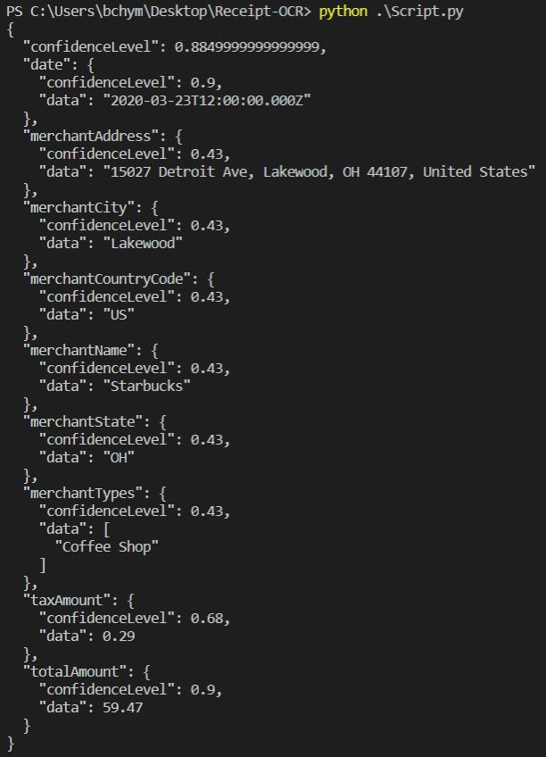
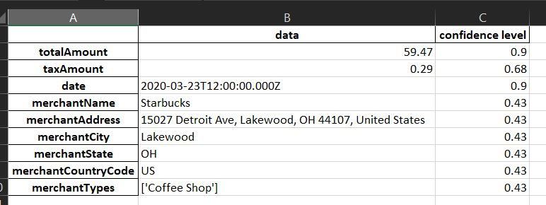

<h1>
    
Receipt OCR

</h1>

<h1></h1>

### Description
I took one of my <a href="https://github.com/bhyman67/Receipt-OCR/blob/master/reciept.jpg">reciepts</a> from King Soopers and wrote a script to extract data from it using the <a href = "https://www.taggun.io/">taggun api</a>. Taggun utilizes OCR. 

Here's what the JSON response was. 

I extracted the data and imported it into pandas dataframe. It looks like this:

Imagine the time savings if we needed to extract totals from hundreds of receipts :). Not all of the extracted info was right. But the total amount, tax, city, and country all were. It didn't pull the itemized info but taggun might have other endpoints for that. This was the output from using their simple/file endpoint. 

### Data

...

### Code

...

Click <a href="https://github.com/bhyman67/Receipt-OCR">here</a> to view this project's repository

Go back to <a href="https://bhyman67.github.io/">BHyman Analytics</a>
